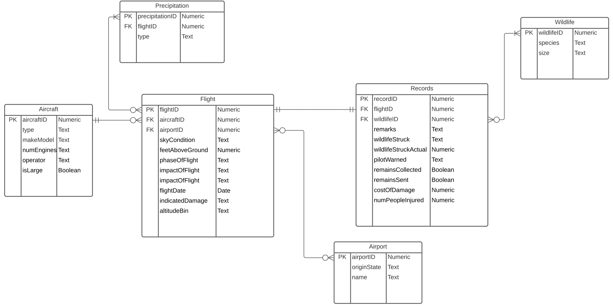
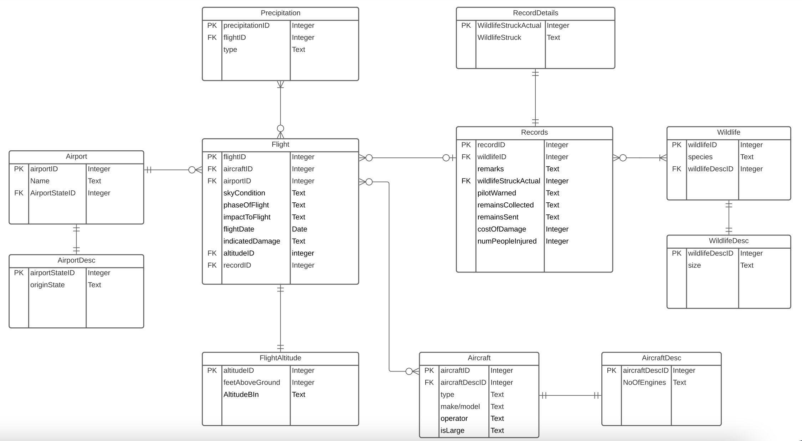

# 0. E-R Diagrams

## Overview

- This section contains the screenshots and Lucid Chart links to the initial
and final E-R diagram drawn in Crow's Foot Notation.

- The tables are in Third Normal Form (3NF).

## 0.1 Initial E-R diagram

- Link to LucidChart for the same: <a href="https://lucid.app/lucidchart/cf7a73f4-b4af-48c0-a859-894191239348/edit?viewport_loc=-1139%2C60%2C2478%2C1145%2C0_0&invitationId=inv_e476806f-413f-4f6f-8e56-bf68e1940500" target="_blank"><strong>E-R Diagram Initial</strong></a>


## 0.2 Final E-R diagram

- Link to LucidChart for the same: <a href="https://lucid.app/lucidchart/6a6a21b3-94a5-494e-9f89-c043c8aff780/edit?viewport_loc=-783%2C-391%2C3758%2C1736%2C0_0&invitationId=inv_13acd69d-9c10-4a3a-94d1-a73677517afc" target="_blank"><strong>E-R Diagram Final</strong></a>


# 1. Clean the data

## Overview
1. This step involves removing 129 rows (which have null values for almost 
all columns), thus considering these columns does not make any sense.

2. Replacing null "Origin State" values with "International" as all 
international flights have null values for this column.

3. Save this into a cleaned CSV - BirdStrikesDataCleaned.csv.
```{r message=FALSE, warning=FALSE, paged.print=FALSE}
df <- read.csv('BirdStrikesData.csv', check.names = FALSE)
nrow(df)
ncol(df)
```


## 1.1 Removing 129 rows
129 rows do not have any data for most of the columns, so dropping these.
Checking with a single column - "Aircraft: Type" will suffice as all the other
fields are null too for the same. We will now work with this cleaned data frame.
```{r message=FALSE, warning=FALSE, paged.print=FALSE}
df_cleaned <- df[df$`Aircraft: Type` != "", ]
nrow(df_cleaned)
ncol(df_cleaned)
```

## 1.2 Replacing null "Origin State" with "International"
Replace origin state with "International" where the Origin State is null,
as this can happen only in cases of international flights.
```{r message=FALSE, warning=FALSE, paged.print=TRUE}
df_cleaned$`Origin State`[df_cleaned$`Origin State` == "N/A"] <- "International"
df_cleaned
```

## 1.3 Dump the cleaned dataframe to a new CSV

```{r message=FALSE, warning=FALSE, paged.print=FALSE}
write.csv(df_cleaned, "BirdStrikesDataCleaned.csv", row.names = F)
```


# 2. DDL Commands 

## Overview

- This step involves writing DDL (Data Definition Language) commands in MySQL
to create tables (or delete them if they already exist) in which the data
from the CSV will be ingested.

## 2.1 Create a connection to the database

- This connects to a remote MariaDB database hosted in AWS RDS (Relational 
Database Service).
```{r message=FALSE, warning=FALSE, paged.print=FALSE}
# This is used to establish a connection to the database and set its file path.

# Library to interact with MySQL
library(RMySQL)

# Settings
db_user <- 'practicum1'
db_password <- 'practicum1' # The top-secret password :)
db_name <- 'practicum1'
db_host <- 'practicum1.c5r3vp6fuc73.us-east-2.rds.amazonaws.com'
db_port <- 3306

# Read data from db
mydb <- dbConnect(RMySQL::MySQL(), user = db_user, password = db_password, dbname = db_name,
                   host = db_host, port = db_port)

options(warn=-1)
```

## 2.2 Read the dataset from cleaned CSV
```{r message=FALSE, warning=FALSE, paged.print=FALSE}
df <- read.csv("BirdStrikesDataCleaned.csv", check.names = FALSE)
```

## 2.3 Drop tables if they exist

- This is to maintain reproducibility, deleting all tables if they exist
in the remote SQL instance.

- The tables are dropped in a way so that they do not break any Foreign Key
constraints.
```{sql connection=mydb}
/*  This is used to prevent error if the table is already created. */
DROP TABLE IF EXISTS Precipitation
```

```{sql connection=mydb}
/*  This is used to prevent error if the table is already created. */
DROP TABLE IF EXISTS Flight
```

```{sql connection=mydb}
/*  This is used to prevent error if the table is already created. */
DROP TABLE IF EXISTS Records
```

```{sql connection=mydb}
/*  This is used to prevent error if the table is already created. */
DROP TABLE IF EXISTS RecordDetails
```

```{sql connection=mydb}
/*  This is used to prevent error if the table is already created. */
DROP TABLE IF EXISTS Wildlife
```

```{sql connection=mydb}
/*  This is used to prevent error if the table is already created. */
DROP TABLE IF EXISTS WildlifeDesc
```

```{sql connection=mydb}
/*  This is used to prevent error if the table is already created. */
DROP TABLE IF EXISTS FlightAltitude
```

```{sql connection=mydb}
/*  This is used to prevent error if the table is already created. */
DROP TABLE IF EXISTS Aircraft
```

```{sql connection=mydb}
/*  This is used to prevent error if the table is already created. */
DROP TABLE IF EXISTS Airport
```

```{sql connection=mydb}
/*  This is used to prevent error if the table is already created. */
DROP TABLE IF EXISTS AirportDesc
```

## 2.4 Create the tables

### 2.4.1 Creating AirportDesc table
```{sql connection=mydb}
/*  This is used to create the table AirportDesc.
 *  airportStateID - PK - This is used to connect to the Airport table.
*/
CREATE TABLE AirportDesc (
  airportStateID INTEGER NOT NULL UNIQUE AUTO_INCREMENT,
  originState TEXT NULL UNIQUE DEFAULT 'International',
  CONSTRAINT PRIMARY KEY (airportStateID)
)
```

### 2.4.2 Separating out data from CSV and ingesting to AirportDesc table
```{r message=TRUE, warning=FALSE, paged.print=FALSE}
# AirportDesc table
originStates <- unique(df[['Origin State']])
originStates <- as.data.frame(originStates)
colnames(originStates) <- c("originState")
write.csv(originStates, "AirportDesc.csv", row.names = FALSE)

# Write the contents of AirportDesc into table
dbWriteTable(mydb, name="AirportDesc", originStates, append = TRUE, row.names=0)
```

### 2.4.3 Verifying insertion of data
```{sql connection=mydb}
/*  This is used to display the AirportDesc Table. */
SELECT * FROM AirportDesc;
```
### 2.4.4 Creating Airport table 
```{sql connection=mydb}
/*  This is used to create the table Airport.
 *  PK - This is used to connect to the Flight table.
*/ 
CREATE TABLE Airport (
  airportID INTEGER NOT NULL AUTO_INCREMENT,
  airportStateID INTEGER NOT NULL,
  name TEXT NOT NULL UNIQUE,
  CONSTRAINT PRIMARY KEY (airportID),
  CONSTRAINT FOREIGN KEY (airportStateID) REFERENCES AirportDesc (airportStateID) ON DELETE CASCADE
)
```

### 2.4.5 Separating out data from CSV and ingesting to Airport table
```{r message=TRUE, warning=FALSE, paged.print=FALSE}
# Airport table
get_origin_state <- function(originState) {
  return(which(originStates$originState == originState))
}

airports <- df[c('Airport: Name', 'Origin State')]
colnames(airports) <- c("Name", "originState")
airports <- airports[!duplicated(airports[, c("Name", "originState")]), ]
originStateId <- c()

for(i in 1:nrow(airports)) {
  originSt <- airports[i, "originState"]
  originStateId <- c(originStateId, get_origin_state(originSt))
}

airports$airportStateId = originStateId
airports <- airports[c("Name", "airportStateId")]
write.csv(airports, "Airport.csv", row.names = FALSE)

# Write the contents of Airport into table
dbWriteTable(mydb, name="Airport", airports, append = TRUE, row.names=0)
```

### 2.4.6 Verifying insertion of data
```{sql connection=mydb}
/*  This is used to display the Airport Table. */
SELECT * FROM Airport;
```

```{sql connection=mydb}
/*  This is used to prevent error if the table is already created. */
DROP TABLE IF EXISTS AircraftDesc
```

### 2.4.7 Creating AircraftDesc table 
```{sql connection=mydb}
/*  This is used to create the table AircraftDesc.
 *  PK - This is used to connect to the Aircraft table.
*/ 
CREATE TABLE AircraftDesc (
  aircraftDescID INTEGER NOT NULL AUTO_INCREMENT,
  noOfEngines TEXT UNIQUE,
  CONSTRAINT PRIMARY KEY (aircraftDescID)
)
```

### 2.4.8 Separating out data from CSV and ingesting to AircraftDesc table
```{r message=TRUE, warning=FALSE, paged.print=FALSE}
# AircraftDesc table
numEngines <- unique(df[['Aircraft: Number of engines?']])
numEngines <- as.data.frame(numEngines)
colnames(numEngines) <- c("noOfEngines")
write.csv(numEngines, "AircraftDesc.csv", row.names = FALSE)

# Write the contents of AircraftDesc into table
dbWriteTable(mydb, name="AircraftDesc", numEngines, append = TRUE, row.names=0)
```

### 2.4.9 Verifying insertion of data
```{sql connection=mydb}
/*  This is used to display the AircraftDesc Table. */
SELECT * FROM AircraftDesc;
```
### 2.4.10 Creating Aircraft table 
```{sql connection=mydb}
/*  This is used to create the table Aircraft.
 *  PK - This is used to connect to the Flight table.
*/
CREATE TABLE Aircraft (
  aircraftID INTEGER NOT NULL AUTO_INCREMENT,
  aircraftDescID INTEGER NOT NULL,
  type TEXT NOT NULL,
  makeModel TEXT NOT NULL,
  operator TEXT NOT NULL,
  isLarge TEXT NOT NULL,
  CONSTRAINT PRIMARY KEY (aircraftID),
  FOREIGN KEY (aircraftDescID) references AircraftDesc(aircraftDescID) ON DELETE CASCADE,
  CONSTRAINT CHECK (isLarge='Yes' OR isLarge='No')
)
```

### 2.4.11 Separating out data from CSV and ingesting to Aircraft table
```{r message=TRUE, warning=FALSE, paged.print=FALSE}
# Aircraft table
get_num_engines <- function(numEngine) {
  return(which(numEngines$noOfEngines == numEngine))
}

aircrafts <- df[c('Aircraft: Type', 'Aircraft: Make/Model', 'Aircraft: Airline/Operator', 'Is Aircraft Large?', 'Aircraft: Number of engines?')]
colnames(aircrafts) <- c("type", "makeModel", "operator", "isLarge", "numEngines")
aircrafts <- aircrafts[!duplicated(aircrafts[, c("type", "makeModel", "operator", "isLarge", "numEngines")]), ]

numEnginesId <- c()

for(i in 1:nrow(aircrafts)) {
  numEngine <- aircrafts[i, "numEngines"]
  numEnginesId <- c(numEnginesId, get_num_engines(numEngine))
}

aircrafts$aircraftDescId = numEnginesId
aircrafts <- aircrafts[c("aircraftDescId", "type", "makeModel", "operator", "isLarge")]
write.csv(aircrafts, "Aircraft.csv", row.names = FALSE)

# Write the contents of Aircraft into table
dbWriteTable(mydb, name="Aircraft", aircrafts, append = TRUE, row.names=0)
```

### 2.4.12 Verifying insertion of data
```{sql connection=mydb}
/*  This is used to display the Aircraft Table. */
SELECT * FROM Aircraft;
```
### 2.4.13 Creating FlightAltitude table 
```{sql connection=mydb}
/*  This is used to create the table FlightAltitude.
 *  PK - This is used to connect to the Flight table.
*/
CREATE TABLE FlightAltitude (
  altitudeID INTEGER NOT NULL AUTO_INCREMENT,
  feetAboveGround NUMERIC NOT NULL,
  altitudeBin TEXT NOT NULL,
  CONSTRAINT PRIMARY KEY (altitudeID)
)
```

### 2.4.14 Separating out data from CSV and ingesting to FlightAltitude table
```{r message=TRUE, warning=FALSE, paged.print=FALSE}
# FlightAltitude Table
flightAltitude <- df[c("Feet above ground", "Altitude bin")]
flightAltitude <- flightAltitude[!duplicated(flightAltitude[, c("Feet above ground", "Altitude bin")]), ]
colnames(flightAltitude) <- c("feetAboveGround", "altitudeBin")
write.csv(flightAltitude, "FlightAltitude.csv", row.names = FALSE)

# Write the contents of FlightAltitude into table
dbWriteTable(mydb, name="FlightAltitude", flightAltitude, append = TRUE, row.names=0)
```

### 2.4.15 Verifying insertion of data
```{sql connection=mydb}
/*  This is used to display the FlightAltitude Table. */
SELECT * FROM FlightAltitude;
```
### 2.4.16 Creating WildlifeDesc table 
```{sql connection=mydb}
/*  This is used to create the table WildlifeDesc.
 *  PK - This is used to connect to the Wildlife table.
*/
CREATE TABLE WildlifeDesc (
  wildlifeDescID INTEGER NOT NULL AUTO_INCREMENT,
  size TEXT NOT NULL UNIQUE,
  CONSTRAINT PRIMARY KEY (wildlifeDescID),
  CONSTRAINT CHECK (size='Medium' OR size='Small' OR size='Large')
)
```

### 2.4.17 Separating out data from CSV and ingesting to WildlifeDesc table
```{r message=TRUE, warning=FALSE, paged.print=FALSE}
# WildlifeDesc Table
wildlifeSize <- df[c("Wildlife: Size")]
wildlifeSize <- wildlifeSize[!duplicated(wildlifeSize[, c("Wildlife: Size")]), ]
wildlifeSize <- as.data.frame(wildlifeSize)
wildlifeSize$size = wildlifeSize$wildlifeSize
wildlifeSize <- wildlifeSize[c("size")]
write.csv(wildlifeSize, "WildlifeDetails.csv", row.names = FALSE)

# Write the contents of WildlifeDesc into table
dbWriteTable(mydb, name="WildlifeDesc", wildlifeSize, append = TRUE, row.names=0)
```

### 2.4.18 Verifying insertion of data
```{sql connection=mydb}
/*  This is used to display the WildlifeDesc Table. */
SELECT * FROM WildlifeDesc;
```

### 2.4.19 Creating Wildlife table 
```{sql connection=mydb}
/*  This is used to create the table Wildlife.
 *  PK - This is used to connect to the Records table.
*/
CREATE TABLE Wildlife (
  wildlifeID INTEGER NOT NULL AUTO_INCREMENT,
  wildlifeDescID INTEGER NOT NULL,
  species TEXT NOT NULL,
  CONSTRAINT PRIMARY KEY (wildlifeID),
  FOREIGN KEY (wildlifeDescID) references WildlifeDesc(wildlifeDescID) ON DELETE CASCADE
)
```

### 2.4.20 Separating out data from CSV and ingesting to Wildlife table
```{r message=TRUE, warning=FALSE, paged.print=FALSE}
# Wildlife table
get_size_id <- function(size) {
  return(which(wildlifeSize$size == size))
}

wildlife <- df[c('Wildlife: Size', 'Wildlife: Species')]
colnames(wildlife) <- c("size", "species")
wildlife <- wildlife[!duplicated(wildlife[, c("size", "species")]), ]

wildlifeSizeId <- c()

for(i in 1:nrow(wildlife)) {
  size <- wildlife[i, "size"]
  wildlifeSizeId <- c(wildlifeSizeId, get_size_id(size))
}

wildlife$wildlifeDescId = wildlifeSizeId
wildlife <- wildlife[c("wildlifeDescId", "species")]
write.csv(wildlife, "Wildlife.csv", row.names = FALSE)

# Write the contents of Wildlife into table
dbWriteTable(mydb, name="Wildlife", wildlife, append = TRUE, row.names=0)
```

### 2.4.21 Verifying insertion of data
```{sql connection=mydb}
/*  This is used to display the Wildlife Table. */
SELECT * FROM Wildlife;
```
### 2.4.22 Creating RecordDetails table
```{sql connection=mydb}
/*  This is used to create the table RecordDetails.
 *  PK - This is used to connect to the Records table.
*/
CREATE TABLE RecordDetails (
  wildlifeStruckActual INTEGER NOT NULL,
  wildlideStruck TEXT NOT NULL,
  CONSTRAINT PRIMARY KEY (wildlifeStruckActual)
)
```

### 2.4.23 Separating out data from CSV and ingesting to RecordDetails table
```{r message=TRUE, warning=FALSE, paged.print=FALSE}
# RecordDetails Table
numStruck <- df[c("Wildlife: Number Struck Actual", "Wildlife: Number struck")]
numStruck <- numStruck[!duplicated(numStruck[, c("Wildlife: Number Struck Actual", "Wildlife: Number struck")]), ]
colnames(numStruck) <- c("wildlifeStruckActual", "wildlideStruck")
write.csv(numStruck, "RecordDetails.csv", row.names = FALSE)

# Write the contents of RecordDetails into table
dbWriteTable(mydb, name="RecordDetails", numStruck, append = TRUE, row.names=0)
```

### 2.4.24 Verifying insertion of data
```{sql connection=mydb}
/*  This is used to display the RecordDetails Table. */
SELECT * FROM RecordDetails;
```
### 2.4.25 Creating Records table 
```{sql connection=mydb}
/*  This is used to create the table Records.
 *  PK - This is used to connect to the Flight table.
*/
CREATE TABLE Records (
  recordID INTEGER NOT NULL,
  wildlifeID INTEGER NOT NULL,
  wildlifeStruckActual INTEGER NOT NULL,
  remarks TEXT,
  pilotWarned TEXT NOT NULL,
  remainsCollected TEXT NOT NULL,
  remainsSent TEXT NOT NULL,
  costOfDamage NUMERIC NOT NULL,
  numPeopleInjured NUMERIC NOT NULL,
  CONSTRAINT PRIMARY KEY (recordID),
  FOREIGN KEY (wildlifeID) references Wildlife(wildlifeID) ON DELETE CASCADE,
  FOREIGN KEY (wildlifeStruckActual) references RecordDetails(wildlifeStruckActual) ON DELETE CASCADE
)
```

### 2.4.26 Separating out data from CSV and ingesting to Records table
```{r message=TRUE, warning=FALSE, paged.print=FALSE}
# Records table
get_wildlife_id <- function(species, size) {
  return(which(wildlife$species == species & wildlife$wildlifeDescId == get_size_id(size)))
}

records <- df[c('Record ID', 'Wildlife: Species', 'Wildlife: Size', 'Wildlife: Number Struck Actual', 'Remarks', 'Pilot warned of birds or wildlife?', 'Remains of wildlife collected?', 'Remains of wildlife sent to Smithsonian', 'Cost: Total $', 'Number of people injured')]
colnames(records) <- c("recordID", "species", "size", "wildlifeStruckActual", "remarks", "pilotWarned", "remainsCollected", "remainsSent", "costOfDamage", "numPeopleInjured")

wildlifeId <- c()

for(i in 1:nrow(records)) {
  size <- records[i, "size"]
  species <- records[i, "species"]
  
  wildlifeId <- c(wildlifeId, get_wildlife_id(species, size))
}

records$wildlifeId <-  wildlifeId
records <- records[c("recordID", "wildlifeId", "wildlifeStruckActual", "remarks", "pilotWarned", "remainsCollected", "remainsSent", "costOfDamage", "numPeopleInjured")]
write.csv(records, "Records.csv", row.names = FALSE)

# Write the contents of Records into table
dbWriteTable(mydb, name="Records", records, append = TRUE, row.names=0)
```

### 2.4.27 Verifying insertion of data
```{sql connection=mydb}
/*  This is used to display the Records Table. */
SELECT * FROM Records;
```
### 2.4.28 Creating Flight table 
```{sql connection=mydb}
/*  This is used to create the table Flight. */
CREATE TABLE Flight (
  flightID INTEGER NOT NULL AUTO_INCREMENT,
  aircraftID INTEGER NOT NULL,
  airportID INTEGER NOT NULL,
  altitudeID INTEGER NOT NULL,
  recordID INTEGER NOT NULL,
  skyCondition TEXT NOT NULL,
  phaseOfFlight TEXT NOT NULL,
  impactToFlight TEXT NOT NULL,
  flightDate TEXT NOT NULL,
  indicatedDamage TEXT NOT NULL,
  CONSTRAINT PRIMARY KEY (flightID),
  FOREIGN KEY (aircraftID) references Aircraft(aircraftID) ON DELETE CASCADE,
  FOREIGN KEY (airportID) references Airport(airportID) ON DELETE CASCADE,
  FOREIGN KEY (altitudeID) references FlightAltitude(altitudeID) ON DELETE CASCADE,
  FOREIGN KEY (recordID) references Records(recordID) ON DELETE CASCADE
)
```

### 2.4.29 Separating out data from CSV and ingesting to Flight table
```{r message=TRUE, warning=FALSE, paged.print=FALSE}
# Flight table
get_num_engines <- function(num_engines) {
  return(which(numEngines$noOfEngines == num_engines))
}

get_aicraft_id <- function(num_engines, type, make_model, operator, is_large) {
  return(which(aircrafts$aircraftDescId == get_num_engines(num_engines) & aircrafts$type == type & aircrafts$makeModel == make_model & aircrafts$operator == operator & aircrafts$isLarge == is_large))
}

get_origin_state <- function(origin_state) {
  return(which(originStates$originState == origin_state))
}

get_airport_id <- function(origin_state, name) {
  return(which(airports$airportStateId == get_origin_state(origin_state) & airports$Name == name))
}

get_altitude_id <- function(feet_above_ground, altitude_bin) {
  return(which(flightAltitude$feetAboveGround == feet_above_ground & flightAltitude$altitudeBin == altitude_bin))
}

get_wildlife_desc_id <- function(size) {
  return(which(wildlifeSize$size == size))
}

get_wildlife_id <- function(size, species) {
  return(which(wildlife$wildlifeDescId == get_wildlife_desc_id(size) & wildlife$species == species))
}

flight <- df[c('Aircraft: Number of engines?', 'Aircraft: Type', 'Aircraft: Make/Model', 'Aircraft: Airline/Operator', 'Is Aircraft Large?', 'Origin State', 'Airport: Name', 'Feet above ground', 'Altitude bin', 'Record ID', "Conditions: Sky", "When: Phase of flight", "Effect: Impact to flight", "FlightDate", "Effect: Indicated Damage")]
colnames(flight) <- c("noOfEngines", "type", "makeModel", "operator", "isLarge", "originState", "airportName", "feetAboveGround", "altitudeBin", "recordID", "skyCondition", "phaseOfFlight", "impactToFlight", "flightDate", "indicatedDamage")

aircraftId <- c()
airportId <- c()
altitudeId <- c()

for(i in 1:nrow(flight)) {
  num_engines <- flight[i, "noOfEngines"]
  type <- flight[i, "type"]
  make_model <- flight[i, "makeModel"]
  operator <- flight[i, "operator"]
  is_large <- flight[i, "isLarge"]
  origin_state <- flight[i, "originState"]
  airport_name <- flight[i, "airportName"]
  feet_above_ground <- flight[i, "feetAboveGround"]
  altitude_bin <- flight[i, "altitudeBin"]
  
  aircraftId <- c(aircraftId, get_aicraft_id(num_engines, type, make_model, operator, is_large))
  airportId <- c(airportId, get_airport_id(origin_state, airport_name))
  altitudeId <- c(altitudeId, get_altitude_id(feet_above_ground, altitude_bin))
}

flight$aircraftID <- aircraftId
flight$airportID <- airportId
flight$altitudeID <- altitudeId
flight <- flight[c("aircraftID", "airportID", "altitudeID", "recordID", "skyCondition", "phaseOfFlight", "impactToFlight", "flightDate", "indicatedDamage")]
write.csv(flight, "Flight.csv", row.names = FALSE)

# Write the contents of Flight into table
dbWriteTable(mydb, name="Flight", flight, append = TRUE, row.names=0)
```

### 2.4.30 Verifying insertion of data
```{sql connection=mydb}
/*  This is used to display the Flight Table. */
SELECT * FROM Flight;
```
### 2.4.31 Creating Precipitation table 
```{sql connection=mydb}
/*  This is used to create the table Precipitation.
 *  PK - This is used to connect to the Flight table.
*/
CREATE TABLE Precipitation (
  precipitationID INTEGER NOT NULL AUTO_INCREMENT,
  flightID INTEGER NOT NULL,
  type TEXT NOT NULL,
  CONSTRAINT PRIMARY KEY (precipitationID),
  FOREIGN KEY (flightID) references Flight(flightID) ON DELETE CASCADE
)
```

### 2.4.32 Separating out data from CSV and ingesting to Precipitation table
```{r message=TRUE, warning=FALSE, paged.print=FALSE}
library(tidyr)

df_no_multival <- df %>% separate_rows(`Conditions: Precipitation`)

# Precipitation table
get_flight_id <- function(record_id) {
  return(which(flight$recordID == record_id))
}

precipitation <- df_no_multival[c('Record ID', 'Conditions: Precipitation')]
colnames(precipitation) <- c("recordID", "type")

flightId <- c()

for(i in 1:nrow(precipitation)) {
  record_id <- precipitation[i, "recordID"][["recordID"]]
  flightId <- c(flightId, get_flight_id(record_id))
}

precipitation$flightID <- flightId
precipitation <- precipitation[c("flightID", "type")]
write.csv(precipitation, "Precipitation.csv", row.names = FALSE)

# Write the contents of Precipitation into table
dbWriteTable(mydb, name="Precipitation", precipitation, append = TRUE, row.names=0)
```

### 2.4.33 Verifying insertion of data
```{sql connection=mydb}
/*  This is used to display the Precipitation Table. */
SELECT * FROM Precipitation;
```
# 3. DML Commands

## Overview

- This section contains the SQL queries that answer the questions asked in 
questions 4 through 8.

## 3.1 Question 4

- Create a SQL query against your database to find the number of bird strike incidents for each airline upon take-off or climb. Include all airlines. You may either use a {sql} code chunk or an R function to execute the query. It must be a single query.
```{sql connection=mydb}
SELECT COUNT(Flight.recordID) AS Number_of_Bird_Strikes, Aircraft.operator FROM Aircraft JOIN Flight ON Aircraft.aircraftID = Flight.aircraftID WHERE phaseOfFlight IN ('Take-off run', 'Climb') GROUP BY Aircraft.operator;
```
## 3.2 Question 5

- Create a SQL query against your database to find the airports that had the most bird strike incidents (during any flight phase). Include all airlines. You may either use a {sql} code chunk or an R function to execute the query. It must be a single query.
```{sql connection=mydb}
SELECT Airport.Name, COUNT(Flight.recordID) AS Bird_Strike_Incidents FROM Flight JOIN
Airport ON Flight.airportID = Airport.airportID GROUP BY Airport.name 
ORDER BY COUNT(Flight.recordID) DESC LIMIT 5;
```

## 3.3 Question 6

- Create a SQL query against your database to find the number of bird strike incidents by year. Include all airlines. You may either use a {sql} code chunk or an R function to execute the query. It must be a single query.
```{sql connection=mydb}
SELECT COUNT(recordID) AS Bird_Strikes, flightDate FROM Flight GROUP BY RIGHT(flightDate, 9);
```
## 3.4 Question 7

- Using the above data, build a column chart that visualizes the number of bird strikes incidents per year from 2008 to 2011 during take-off/climbing and during descent/approach/landing, so you can compare one versus the other. Adorn the graph with appropriate axis labels, titles, legend, data labels, etc.
```{r message=TRUE, warning=FALSE, paged.print=FALSE}
options(sqldf.driver = "SQLite")
library(sqldf)

sqlDataFlight = "SELECT * FROM Flight"
flight_data = dbGetQuery(mydb, sqlDataFlight)
rs_flight_data <- (flight_data)

results_2008a <- sqldf("SELECT COUNT(recordID) FROM rs_flight_data WHERE flightDate LIKE '%2008%' AND phaseOfFlight IN ('Climb', 'Take-off run') ")
results_2008b <- sqldf("SELECT COUNT(recordID) FROM rs_flight_data WHERE flightDate LIKE '%2008%' AND phaseOfFlight IN ('Descent', 'Approach', 'Landing Roll') ")

results_2009a <- sqldf("SELECT COUNT(recordID) FROM rs_flight_data WHERE flightDate LIKE '%2009%' AND phaseOfFlight IN ('Climb', 'Take-off run') ")
results_2009b <- sqldf("SELECT COUNT(recordID) FROM rs_flight_data WHERE flightDate LIKE '%2009%' AND phaseOfFlight IN ('Descent', 'Approach', 'Landing Roll') ")

results_2010a <- sqldf("SELECT COUNT(recordID) FROM rs_flight_data WHERE flightDate LIKE '%2010%' AND phaseOfFlight IN ('Climb', 'Take-off run') ")
results_2010b <- sqldf("SELECT COUNT(recordID) FROM rs_flight_data WHERE flightDate LIKE '%2010%' AND phaseOfFlight IN ('Descent', 'Approach', 'Landing Roll') ")

results_2011a <- sqldf("SELECT COUNT(recordID) FROM rs_flight_data WHERE flightDate LIKE '%2011%' AND phaseOfFlight IN ('Climb', 'Take-off run') ")
results_2011b <- sqldf("SELECT COUNT(recordID) FROM rs_flight_data WHERE flightDate LIKE '%2011%' AND phaseOfFlight IN ('Descent', 'Approach', 'Landing Roll') ")

# Create the data for the chart
H <- c(strtoi(results_2008a), strtoi(results_2008b), strtoi(results_2009a), strtoi(results_2009b), strtoi(results_2010a), strtoi(results_2010b), strtoi(results_2011a), strtoi(results_2011b))
M <- c("2008", "", "2009", "", "2010", "", "2011", "")

# Plot the bar chart 
barplot(H,names.arg=M,xlab="YEARS",ylab="BIRD STRIKE INCIDENTS",col=c("yellow", "pink"),
main="Column chart",border="red")
legend("topright", legend = c("Take-off", "Land"), fill = c("yellow", "pink"))
```

## 3.5 Question 8

- Create a stored procedure in MySQL (note that if you used SQLite, then you cannot complete this step) that removes a bird strike incident from the database. You may decide what you need to pass to the stored procedure to remove a bird strike incident, e.g., departure airport, airlines, or some ID. Show that the deletion worked as expected.
```{sql connection=mydb}
DROP procedure DELETE_RECORD;
```

```{sql connection=mydb}
CREATE PROCEDURE DELETE_RECORD (
	IN deleteRecordID INTEGER(11)
)
  DELETE FROM Records WHERE recordID = deleteRecordID;
```

```{sql connection=mydb}
/* To check the number of rows in Records before calling the stored procedure. */
SELECT COUNT(*) AS TOTAL_RECORDS FROM Records;
```

```{sql connection=mydb}
/* Call the Stored Procedure.  */
CALL DELETE_RECORD(202152);
```

```{sql connection=mydb}
/* To check the number of rows in Records after calling the stored procedure. */
SELECT COUNT(*) AS TOTAL_RECORDS FROM Records;
```

# 4. Disconnect the database connection

- Our work is done here, so let's free the database connection.
```{r message=TRUE, warning=FALSE, paged.print=FALSE}
dbDisconnect(mydb)
```

# 5. Proof for 3NF

## Overview

- This section contains the proof that the tables are in Third Normal Form 
(3NF).

## Document with proof

- Follow this 
<a href="https://docs.google.com/document/d/1cmQY8u_c2om0no9bP6whboPWvVwA3LlIRYGBS1tKOsA/edit?usp=sharing" target="_blank">
<strong>link to Google Document</strong></a> containing the proof for 3NF of the tables.