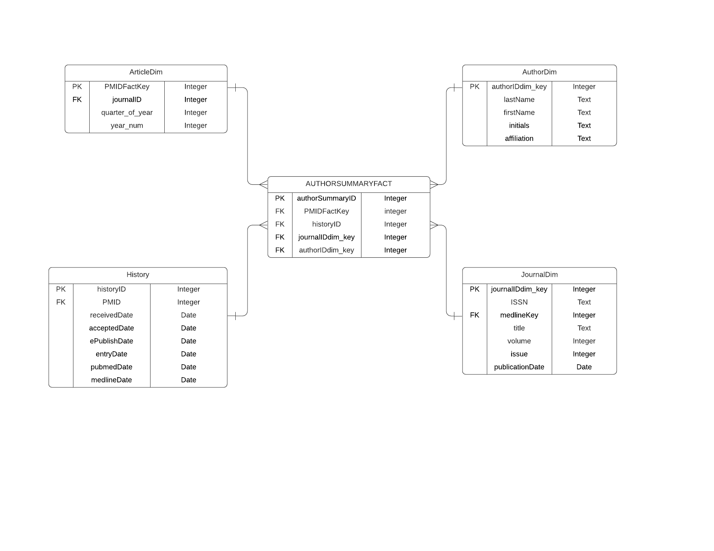

# 1. E-R Diagrams

## Overview

- This section contains the screenshots and Lucid Chart links to the initial
and final E-R diagram drawn in Crow's Foot Notation.

- The tables are in Third Normal Form (3NF).
  
## 1.1 Initial E-R diagram

- Link to LucidChart for the same: <a href="https://lucid.app/lucidchart/9762eee3-50fa-41a3-870c-19eef57f1b23/edit?viewport_loc=-65%2C318%2C1964%2C851%2C0_0&invitationId=inv_bf67ee18-7771-4f3f-95fc-daa9fc228d30" target="_blank"><strong>E-R Diagram</strong></a>


## 1.2 Create a connection to the database

- This connects to a remote MariaDB database hosted in AWS RDS (Relational 
Database Service).

```{r message=FALSE, warning=FALSE, paged.print=FALSE}
# This is used to establish a connection to the database and set its file path.

# Library to interact with MySQL
library(RMySQL)

# Settings
db_user <- 'practicum1'
db_password <- 'practicum1' # The top-secret password :)
db_name <- 'practicum2_2'
db_host <- 'practicum1.c5r3vp6fuc73.us-east-2.rds.amazonaws.com'
db_port <- 3306


# Read data from db
mydb <- dbConnect(RMySQL::MySQL(), user = db_user, password = db_password, dbname = db_name,
                   host = db_host, port = db_port)

options(warn=-1)
```
## 1.2 Drop tables if they exist

- This is to maintain reproducibility, deleting all tables if they exist
in the remote SQL instance.

- The tables are dropped in a way so that they do not break any Foreign Key
constraints.

# PART 1 - 2

```{sql connection=mydb}
/*  This is used to prevent error if the table is already created. */
DROP TABLE IF EXISTS AuthorList
```

```{sql connection=mydb}
/*  This is used to prevent error if the table is already created. */
DROP TABLE IF EXISTS History
```

```{sql connection=mydb}
/*  This is used to prevent error if the table is already created. */
DROP TABLE IF EXISTS Article
```

```{sql connection=mydb}
/*  This is used to prevent error if the table is already created. */
DROP TABLE IF EXISTS Journal
```

```{sql connection=mydb}
/*  This is used to prevent error if the table is already created. */
DROP TABLE IF EXISTS MedlineJournalInfo
```

```{sql connection=mydb}
/*  This is used to prevent error if the table is already created. */
DROP TABLE IF EXISTS Author
```


## 1.2 Create the tables

###  Creating Author table

```{sql connection=mydb}
/*  This is used to create the table Author
 *  authorID - PK - This is used to connect to the Author table.
*/
CREATE TABLE Author (
  authorID INTEGER NOT NULL UNIQUE AUTO_INCREMENT,
 lastName TEXT,
 firstName TEXT,
initials TEXT,
affiliation TEXT DEFAULT NULL,
  CONSTRAINT PRIMARY KEY (authorID)
)
```
###  Creating MedlineJournalInfo table

```{sql connection=mydb}
/*  This is used to create the table MedlineJournalInfo
 *  medlineKey - PK - This is used to connect to the MedlineJournalInfo table.
*/
CREATE TABLE MedlineJournalInfo (
medlineKey INTEGER NOT NULL UNIQUE AUTO_INCREMENT,
  nlmUniqueID INTEGER NOT NULL,
 country TEXT,
 medlineTA TEXT,
ISSNLinking TEXT,
  CONSTRAINT PRIMARY KEY (medlineKey)
)
```
###  Creating Journal table


```{sql connection=mydb}
/*  This is used to create the table Journal
 *  journalID - PK - This is used to connect to the Journal table.
*/
CREATE TABLE Journal (
journalID INTEGER NOT NULL UNIQUE AUTO_INCREMENT,
  ISSN VARCHAR(200),
 medlineKey Integer NOT NULL UNIQUE,
 title TEXT,
 volume INTEGER,
issue INTEGER,
publicationDate Date,
  CONSTRAINT PRIMARY KEY (journalID),
      CONSTRAINT FOREIGN KEY (medlineKey) REFERENCES MedlineJournalInfo (medlineKey) ON DELETE CASCADE
)
```

###  Creating Article table

```{sql connection=mydb}
/*  This is used to create the table Article
 *  PMID - PK - This is used to connect to the Article table.
*/
CREATE TABLE Article (
  PMID INTEGER NOT NULL UNIQUE,
 journalID INTEGER NOT NULL UNIQUE,
 articleTitle TEXT,
 dateCreated DATE,
articleDateElectronic TEXT,
  CONSTRAINT PRIMARY KEY (PMID),
    CONSTRAINT FOREIGN KEY (journalID) REFERENCES Journal (journalID) ON DELETE CASCADE
)
```

###  Creating History table

```{sql connection=mydb}
/*  This is used to create the table History
 *  historyID - PK - This is used to connect to the History table.
*/
CREATE TABLE History (
    historyID INTEGER NOT NULL UNIQUE AUTO_INCREMENT,
    PMID Integer NOT NULL UNIQUE,
receivedDate Date,
acceptedDate Date,
ePublishDate Date,
entryDate Date,
pubmedDate Date,
medlineDate Date,
  CONSTRAINT PRIMARY KEY (historyID),
    CONSTRAINT FOREIGN KEY (PMID) REFERENCES Article (PMID) ON DELETE CASCADE
)
```

###  Creating AuthorList table

```{sql connection=mydb}
/*  This is used to create the table AuthorList
*/
CREATE TABLE AuthorList (
   PMID INTEGER NOT NULL UNIQUE,
  authorID INTEGER NOT NULL UNIQUE,
    CONSTRAINT FOREIGN KEY (PMID) REFERENCES Article (PMID) ON DELETE CASCADE,
        CONSTRAINT FOREIGN KEY (authorID) REFERENCES Author (authorID) ON DELETE CASCADE
)
```

##SET UP XPATH

##PART 1 - 3 EXTRACT DATA AND TRANSFORM DATA FROM THE XML AND LOAD IN APPROPRIATE TABLE
```{r}
### This is used to set path and provide xml file to create the xml object and parse using xml Tree Parser.

library("XML")

path <- "D:/Documents/Sqlite Databases/DB Practicum 2/"
xmlFile <- "pubmed_sample.xml"

fp <- paste0(path, xmlFile)
#dbfp <- paste0(path, mydb)


xmlObj <- xmlParse(fp)
xmlObjTree <- xmlTreeParse(fp)
 
```


```{r}

# Creation of Author Data Frame.

author.df <- paste("/PubmedArticleSet/PubmedArticle/MedlineCitation/Article/AuthorList/Author", sep="")

xPathAuthor <- xpathSApply(xmlObj, author.df)

parseAuthor <- function (anAuthorNode)
{
  # parse the address into its components
  lastname <- xmlValue(anAuthorNode[[1]])
  firstname <- xmlValue(anAuthorNode[[2]])
  initials <- xmlValue(anAuthorNode[[3]])
  affiliations <- xmlValue(anAuthorNode[[4]])
  
  newAuthor.df <- data.frame(lastname, firstname, initials, affiliations, 
                           stringsAsFactors = F)
  
  return(newAuthor.df)
}

AllAuthor <- data.frame()
for ( author in xPathAuthor)
  {
    AllAuthor <- rbind(AllAuthor, parseAuthor(author))
  }
  
colnames(AllAuthor) <- c('lastname', 'firstname', 'initials','affiliation')
#print(AllAuthor)

```

```{r}
 # This is used to write the date frame to the Table.

 dbWriteTable(mydb, name = "Author", AllAuthor, append = TRUE, row.names = 0)
```

```{sql connection=mydb}
 /* This is used to display the Author Table.*/

 SELECT * FROM Author;

```

```{r}

# Creation of MedlineJournalInfo Data Frame.

MedlineJournalInfo.df <- paste("/PubmedArticleSet/PubmedArticle/MedlineCitation/MedlineJournalInfo", sep="")

xPathMedlineJournalInfo <- xpathSApply(xmlObj, MedlineJournalInfo.df)

parseJournalInfo <- function (anInfoNode)
{
  # parse the address into its components
  country <- xmlValue(anInfoNode[[1]])
  medlineTA <- xmlValue(anInfoNode[[2]])
  nlmUniqueID <- xmlValue(anInfoNode[[3]])
  ISSNLinking <- xmlValue(anInfoNode[[4]])
  
  newJournalInfo.df <- data.frame(nlmUniqueID, country, medlineTA, ISSNLinking,
                           stringsAsFactors = F)
  
  return(newJournalInfo.df)
}

AllMediaJournalInfo <- data.frame()
for (medlineInfo in xPathMedlineJournalInfo)
  {
    AllMediaJournalInfo <- rbind(AllMediaJournalInfo, parseJournalInfo(medlineInfo))
  }
  
colnames(AllMediaJournalInfo) <- c('nlmUniqueID', 'country', 'medlineTA', 'ISSNLinking')
#print(AllMediaJournalInfo)

```

```{r}
 # This is used to write the date frame to the Table.

 dbWriteTable(mydb, name = "MedlineJournalInfo", AllMediaJournalInfo, append = TRUE, row.names = 0)
```

```{sql connection=mydb}
/* This is used to display the MedlineJournalInfo Table.*/

 SELECT * FROM MedlineJournalInfo;

```


```{r}

# Creation of Journal Data Frame.

Journal.df <- paste("/PubmedArticleSet/PubmedArticle/MedlineCitation/Article/Journal", sep="")

xPathJournal <- xpathSApply(xmlObj, Journal.df)


parseJournal <- function (aJournalNode)
{
  # parse the address into its components
  ISSN <- xmlValue(aJournalNode[[1]])
  Volume <- xmlValue(xpathSApply(aJournalNode[[2]],"Volume"))
  Issue <- xmlValue(xpathSApply(aJournalNode[[2]],"Issue"))
  
  
  DateYear1 <- xmlValue(xpathSApply(aJournalNode[[2]],"PubDate/Year"))
  DateYear2 <- xmlValue(xpathSApply(aJournalNode[[2]],"PubDate/MedlineDate"))
   

  DateMonth1 <- xmlValue(xpathSApply(aJournalNode[[2]],"PubDate/Month"))
  DateMonth2 <- xmlValue(xpathSApply(aJournalNode[[2]],"PubDate/MedlineDate"))
  
  
  if (length(DateYear1) == 0)
  {
    DateYear <- substring(DateYear2, 1, 4)
  }
  else {
    DateYear <- DateYear1
  }
  
  #print(DateYear)
  
  if (length(DateMonth1) != 0)
  {
    DateMonth <- DateMonth1
  }
  else if (length(DateMonth2) != 0)
  {
    DateMonth <- substring(DateYear2, 6, 8)
  }
  else
  {
    DateMonth <- "Jan"
  }
  
  
  title <- xmlValue(aJournalNode[[3]])
  
  if (DateMonth == "Jan")
  {
    DateMonth = "-01-"
  } else if (DateMonth == "Feb") {
    DateMonth = "-02-"
  }
  else if (DateMonth == "Mar") {
    DateMonth = "-03-"
  }
  else if (DateMonth == "Apr") {
    DateMonth = "-04-"
  }
  else if (DateMonth == "May") {
    DateMonth = "-05-"
  }
  else if (DateMonth == "Jun") {
    DateMonth = "-06-"
  }
  else if (DateMonth == "Jul") {
    DateMonth = "-07-"
  }
  else if (DateMonth == "Aug") {
    DateMonth = "-08-"
  }
  else if (DateMonth == "Sep") {
    DateMonth = "-09-"
  }
  else if (DateMonth == "Oct") {
    DateMonth = "-10-"
  }
  else if (DateMonth == "Nov") {
    DateMonth = "-11-"
  }
  else if (DateMonth == "Dec") {
    DateMonth = "-12-"
  }
  
  Date <- paste(DateYear, DateMonth, sep="")
  Date <- paste(Date, "01", sep="")
  
  newJournalInfo.df <- data.frame(ISSN, Volume, Issue, Date, title,
                           stringsAsFactors = F)
  
  
  return(newJournalInfo.df)
}

AllJournal <- data.frame()
for (journal in xPathJournal)
  {
    AllJournal <- rbind(AllJournal, parseJournal(journal))
  }
  
for (i in 1:19) {
  AllJournal$medlineKey[i] <- i
}

colnames(AllJournal) <- c('ISSN', 'volume', 'issue', 'publicationDate', 'title', 'medlineKey')
#print(AllJournal)

```

```{r}
 # This is used to write the date frame to the Table.

 dbWriteTable(mydb, name = "Journal", AllJournal, append = TRUE, row.names = 0)
```

```{sql connection=mydb}
 /* This is used to display the Journal Table.*/

 SELECT * FROM Journal;

```


```{r}

# Creation of Article Data Frame.

Article.df <- paste("/PubmedArticleSet/PubmedArticle/MedlineCitation", sep="")

xPathArticle <- xpathSApply(xmlObj, Article.df)

parseArticle <- function (anArticleNode)
{
  # parse the address into its components
  pmid <- xmlValue(anArticleNode[[1]])
  
  articleTitle <- xmlValue(xpathSApply(anArticleNode[[5]], "ArticleTitle"))
  if (length(articleTitle) == 0)
  {
    articleTitle <- xmlValue(xpathSApply(anArticleNode[[4]], "ArticleTitle"))
  }
  
  dateCreated <- xmlValue(anArticleNode[[2]])
  
  dateYYYY <- paste(substring(dateCreated, 1, 4))
  dateMM <- paste(substring(dateCreated, 5, 6))
  dateDD <- paste(substring(dateCreated, 7, 8))
  
  dateCreated <- paste(dateYYYY,"-", sep="")
  dateCreated <- paste(dateCreated, dateMM, sep="")
  dateCreated <- paste(dateCreated, "-", sep = "")
  dateCreated <- paste(dateCreated, dateDD, sep="")
  
  articleDateElectronic <- xmlValue(xpathSApply(anArticleNode[[5]], "ArticleDate"))
  
  if (length(articleDateElectronic) == 0) {
    articleDateElectronic <- xmlValue(anArticleNode[[2]])
  }
  
  newJournalInfo.df <- data.frame(pmid, articleTitle, dateCreated,
                           articleDateElectronic, stringsAsFactors = F)
  
  return(newJournalInfo.df)
}


AllArticle <- data.frame()
for (Article in xPathArticle)
  {
    AllArticle <- rbind(AllArticle, parseArticle(Article))
  }
  
  for (i in 1:19) {
  AllArticle$journalID[i] <- i
}

colnames(AllArticle) <- c('PMID', 'articleTitle', 'dateCreated', 'articleDateElectronic', 'journalID')
#print(AllArticle)

```

```{r}
 # This is used to write the date frame to the Table.

 dbWriteTable(mydb, name = "Article", AllArticle, append = TRUE, row.names = 0)

```

```{sql connection=mydb}
 /* This is used to display the Article Table.*/
 
 SELECT * FROM Article;

```

```{r}

# Creation of History Data Frame.

History.df <- paste("/PubmedArticleSet/PubmedArticle", sep="")

xPathHistory <- xpathSApply(xmlObj, History.df)

parseHistory <- function (aHistoryNode)
{
  # parse the address into its components
  PMID <- xmlValue(xpathSApply(aHistoryNode[[1]], "PMID"))
  
  rdateYYYY <- xmlValue(xpathSApply(aHistoryNode[[2]], "History/PubMedPubDate[@PubStatus='received']/Year"))
  rdateMM <- xmlValue(xpathSApply(aHistoryNode[[2]], "History/PubMedPubDate[@PubStatus='received']/Month"))
  rdateDD <- xmlValue(xpathSApply(aHistoryNode[[2]], "History/PubMedPubDate[@PubStatus='received']/Day"))
  
  receivedDate <- paste(rdateYYYY,"-", sep="")
  receivedDate <- paste(receivedDate, rdateMM, sep="")
  receivedDate <- paste(receivedDate, "-", sep = "")
  receivedDate <- paste(receivedDate, rdateDD, sep="")
  
  if (length(rdateYYYY) == 0 && length(rdateMM) == 0 && length(rdateDD) == 0) {
    receivedDate <- ""
  }
  
  adateYYYY <- xmlValue(xpathSApply(aHistoryNode[[2]], "History/PubMedPubDate[@PubStatus='accepted']/Year"))
  adateMM <- xmlValue(xpathSApply(aHistoryNode[[2]], "History/PubMedPubDate[@PubStatus='accepted']/Month"))
  adateDD <- xmlValue(xpathSApply(aHistoryNode[[2]], "History/PubMedPubDate[@PubStatus='accepted']/Day"))
  
  acceptedDate <- paste(adateYYYY,"-", sep="")
  acceptedDate <- paste(acceptedDate, adateMM, sep="")
  acceptedDate <- paste(acceptedDate, "-", sep = "")
  acceptedDate <- paste(acceptedDate, adateDD, sep="")
  
  if (length(adateYYYY) == 0 && length(adateMM) == 0 && length(adateDD) == 0) {
    acceptedDate <- ""
  }
  
  edateYYYY <- xmlValue(xpathSApply(aHistoryNode[[2]], "History/PubMedPubDate[@PubStatus='epublish']/Year"))
  edateMM <- xmlValue(xpathSApply(aHistoryNode[[2]], "History/PubMedPubDate[@PubStatus='epublish']/Month"))
  edateDD <- xmlValue(xpathSApply(aHistoryNode[[2]], "History/PubMedPubDate[@PubStatus='epublish']/Day"))
  
  ePublishDate <- paste(edateYYYY,"-", sep="")
  ePublishDate <- paste(ePublishDate, edateMM, sep="")
  ePublishDate <- paste(ePublishDate, "-", sep = "")
  ePublishDate <- paste(ePublishDate, edateDD, sep="")
  
  if (length(edateYYYY) == 0 && length(edateMM) == 0 && length(edateDD) == 0) {
    ePublishDate <- ""
  }
  
  endateYYYY <- xmlValue(xpathSApply(aHistoryNode[[2]], "History/PubMedPubDate[@PubStatus='entrez']/Year"))
  endateMM <- xmlValue(xpathSApply(aHistoryNode[[2]], "History/PubMedPubDate[@PubStatus='entrez']/Month"))
  endateDD <- xmlValue(xpathSApply(aHistoryNode[[2]], "History/PubMedPubDate[@PubStatus='entrez']/Day"))
  
  entryDate <- paste(endateYYYY,"-", sep="")
  entryDate <- paste(entryDate, endateMM, sep="")
  entryDate <- paste(entryDate, "-", sep = "")
  entryDate <- paste(entryDate, endateDD, sep="")
  
  if (length(endateYYYY) == 0 && length(endateMM) == 0 && length(endateDD) == 0) {
    entryDate <- ""
  }
  
  pdateYYYY <- xmlValue(xpathSApply(aHistoryNode[[2]], "History/PubMedPubDate[@PubStatus='pubmed']/Year"))
  pdateMM <- xmlValue(xpathSApply(aHistoryNode[[2]], "History/PubMedPubDate[@PubStatus='pubmed']/Month"))
  pdateDD <- xmlValue(xpathSApply(aHistoryNode[[2]], "History/PubMedPubDate[@PubStatus='pubmed']/Day"))
  
  pubmedDate <- paste(pdateYYYY,"-", sep="")
  pubmedDate <- paste(pubmedDate, pdateMM, sep="")
  pubmedDate <- paste(pubmedDate, "-", sep = "")
  pubmedDate <- paste(pubmedDate, pdateDD, sep="")
    
    if (length(pdateYYYY) == 0 && length(pdateMM) == 0 && length(pdateDD) == 0) {
    pubmedDate <- ""
  }
    
  mdateYYYY <- xmlValue(xpathSApply(aHistoryNode[[2]], "History/PubMedPubDate[@PubStatus='medline']/Year"))
  mdateMM <- xmlValue(xpathSApply(aHistoryNode[[2]], "History/PubMedPubDate[@PubStatus='medline']/Month"))
  mdateDD <- xmlValue(xpathSApply(aHistoryNode[[2]], "History/PubMedPubDate[@PubStatus='medline']/Day"))
  
  medlineDate <- paste(mdateYYYY,"-", sep="")
  medlineDate <- paste(medlineDate, mdateMM, sep="")
  medlineDate <- paste(medlineDate, "-", sep = "")
  medlineDate <- paste(medlineDate, mdateDD, sep="")
  
  if (length(mdateYYYY) == 0 && length(mdateMM) == 0 && length(mdateDD) == 0) {
    medlineDate <- ""
  }
  
  newHistory.df <- data.frame(PMID, receivedDate, acceptedDate, ePublishDate,
                           entryDate, pubmedDate, medlineDate, 
                           stringsAsFactors = F)
  
  return(newHistory.df)
}

 AllHistory <- data.frame()
 for (history in xPathHistory)
  {
    AllHistory <- rbind(AllHistory, parseHistory(history))
  }
  
colnames(AllHistory) <- c('PMID', 'receivedDate', 'acceptedDate', 'ePublishDate', 'entryDate', 'pubmedDate', 'medlineDate')
#print(AllHistory)

```

```{r}
 # This is used to write the date frame to the Table.

 dbWriteTable(mydb, name = "History", AllHistory, append = TRUE, row.names = 0)

```

```{sql connection=mydb}
 /* This is used to display the History Table.*/
 
 SELECT * FROM History;

```

```{r}

# Creation of AuthorList Data Frame.

AuthorList.df <- paste("/PubmedArticleSet/PubmedArticle/MedlineCitation/PMID", sep="")

xPathAuthorList <- xpathSApply(xmlObj, AuthorList.df)

parseAuthorList <- function (anAuthorListNode)
{
  # parse the address into its components
  PMID <- xmlValue(anAuthorListNode[[1]])
  
  newAuthorList.df <- data.frame(PMID, stringsAsFactors = F)
  
  return(newAuthorList.df)
}

AllAuthorList <- data.frame()
for (AuthorList in xPathAuthorList)
  {
    AllAuthorList <- rbind(AllAuthorList, parseAuthorList(AuthorList))
  }

  for (i in 1:19) {
  AllAuthorList$authorID[i] <- i
  }  

colnames(AllAuthorList) <- c('PMID', 'authorID')
#print(AllAuthorList)

```

```{r}
 # This is used to write the date frame to the Table.

 dbWriteTable(mydb, name = "AuthorList", AllAuthorList, append = TRUE, row.names = 0)

```

```{sql connection=mydb}
 /* This is used to display the AuthorList Table.*/

 SELECT * FROM AuthorList;

```


#PART 2 CREATE STAR-SCHEMA

## 1.1 Star schema

- Link to LucidChart for the same: <a href="https://lucid.app/lucidchart/9c5bbbce-e026-4b27-96f0-185493fc1049/edit?viewport_loc=-12%2C65%2C1951%2C939%2C0_0&invitationId=inv_47cdc8c7-4ded-47e4-a7a2-41145247ba41" target="_blank"><strong>Star Schema E-R Diagram</strong></a>


```{sql connection=mydb}
/*  This is used to prevent error if the table is already created. */
 DROP TABLE IF EXISTS AUTHORSUMMARYFACT;
```

```{sql connection=mydb}
/*  This is used to prevent error if the table is already created. */
DROP TABLE IF EXISTS AuthorDim;
```

```{sql connection=mydb}
/*  This is used to prevent error if the table is already created. */
DROP TABLE IF EXISTS ArticleDim;
```

```{sql connection=mydb}
/*  This is used to prevent error if the table is already created. */
DROP TABLE IF EXISTS HistoryDim;
```

```{sql connection=mydb}
/*  This is used to prevent error if the table is already created. */
DROP TABLE IF EXISTS JournalDim;
```

```{sql connection=mydb}
/*  This is used to create the table AuthorDim.*/
CREATE TABLE AuthorDim
   AS SELECT authorID AS authorIDdim_key,lastName,firstName,initials,affiliation FROM Author;
```

```{sql connection=mydb}
/*This is used to display AuthorDim table data.*/
Select * from AuthorDim;
```

```{sql connection=mydb}
/*  This is used to create the table ArticleDim*/
CREATE TABLE ArticleDim (
  PMIDFactKey INTEGER NOT NULL UNIQUE,
  journalID INTEGER,
quarter_of_year INTEGER,
year_num INTEGER
);

```

```{sql connection=mydb}
/*This is used to insert data in ArticleDim table.*/
INSERT INTO ArticleDim (PMIDFactKey,journalID,quarter_of_year,year_num) 
   SELECT PMID AS PMIDFactKey,journalID AS journalID,quarter(dateCreated) AS quarter_of_year,year(dateCreated) AS year_num FROM Article;
   
```

```{sql connection=mydb}
/*This is used to display ArticleDim table data.*/
Select * from ArticleDim;
```


```{sql connection=mydb}
/*  This is used to create the table JournalDim*/
CREATE TABLE JournalDim
   AS SELECT journalID AS journalIDdim_key,ISSN,medlineKey,title,volume,issue,publicationDate FROM Journal;
```

```{sql connection=mydb}
/*This is used to display JournalDim table data.*/
Select * from JournalDim;
```


```{sql connection=mydb}
/*This is used to display AuthorSummary Fact table data.*/
CREATE TABLE AUTHORSUMMARYFACT( authorSummaryID INTEGER NOT NULL AUTO_INCREMENT, AuthorID INTEGER, JournalID INTEGER ,PMID INTEGER ,Quarter INTEGER,PRIMARY KEY (authorSummaryID)); 

```


###Inserting data in Author Summary Fact table using R
```{r message=FALSE, warning=FALSE, paged.print=FALSE}

query="INSERT INTO AUTHORSUMMARYFACT (AuthorID,JournalID,Quarter,PMID) 
 SELECT  AuthorList.authorID AS AuthorID,ArticleDim.journalID AS JournalID, ArticleDim.quarter_of_year AS Quarter, ArticleDim.PMIDFactKey AS PMID
FROM AuthorList
JOIN ArticleDim
  ON AuthorList.PMID = ArticleDim.PMIDFactKey
JOIN Author
  ON AuthorList.authorID = Author.authorID";
AUTHORSUMMARYFACT<-dbGetQuery(mydb, query)
AUTHORSUMMARYFACT
```

```{sql connection=mydb}
/*This is used to display AUTHORSUMMARYFACT table data.*/
SELECT * from AUTHORSUMMARYFACT;
```


```{sql connection=mydb}
/*  This is used to create the table HistoryDim*/
CREATE TABLE HistoryDim
   AS SELECT historyID AS historyIDdim_key,PMID,receivedDate,acceptedDate,ePublishDate,
   entryDate,pubmedDate,medlineDate FROM History;
```

```{sql connection=mydb}
/*This is used to display HistoryDim Fact table data.*/
SELECT * from HistoryDim;
```

#PART 3- EXPLORE AND MINE DATA

```{sql connection=mydb}
 /* This is used to display the Number of Publications in each Quarter.*/

SELECT COUNT(Quarter) AS Count_Per_Quarter, Quarter FROM AUTHORSUMMARYFACT GROUP BY Quarter;

```

```{sql connection=mydb}
 /* This is used to display the Number of Publications in each Year.*/
 
SELECT COUNT(year_num) AS Count_Per_Year, year_num FROM ArticleDim GROUP BY year_num;

```


```{r}
 # Plot the chart(Bar Plot Graph) for Number of Publications for each Quarter. 

options(sqldf.driver = "SQLite")
library(sqldf)

sqlFactData = "SELECT * FROM AUTHORSUMMARYFACT"
publication_count_data = dbGetQuery(mydb, sqlFactData)
rs_publication_count_data <- (publication_count_data)

results_FirstQuarter <- sqldf("SELECT COUNT(Quarter) AS Count_Per_Quarter
                              FROM rs_publication_count_data WHERE Quarter = 1 GROUP BY Quarter")
results_SecondQuarter <- sqldf("SELECT COUNT(Quarter) AS Count_Per_Quarter
                              FROM rs_publication_count_data  WHERE Quarter = 2 GROUP BY Quarter")
results_ThirdQuarter <- sqldf("SELECT COUNT(Quarter) AS Count_Per_Quarter
                              FROM rs_publication_count_data WHERE Quarter = 3 GROUP BY Quarter")
results_FourthQuarter <- sqldf("SELECT COUNT(Quarter) AS Count_Per_Quarter
                              FROM rs_publication_count_data WHERE Quarter = 4 GROUP BY Quarter")


H <- c(strtoi(results_FirstQuarter), strtoi(results_SecondQuarter), strtoi(results_ThirdQuarter), strtoi(results_FourthQuarter))
M <- c("Jan-Mar", "Apr-Jun", "Jul-Sep", "Oct-Dec")

# Plot the bar chart 
barplot(H,names.arg=M,xlab="Quarter",ylab="Publications Per Quarter",col=c("yellow", "pink", "blue", "green"),
main="Column chart",border="red")

```


```{r}
 # Plot the chart(Line Graph Chart) for Number of Publications for each Quarter.  

# Create the data for the chart.
v <- c(strtoi(results_FirstQuarter), strtoi(results_SecondQuarter), strtoi(results_ThirdQuarter), strtoi(results_FourthQuarter))
M <- c("Jan-Mar", "Apr-Jun", "Jul-Sep", "Oct-Dec")

# Plot the bar chart.
plot(v, type = "o", col = "red", xaxt = "n", xlab = "Quarter", ylab = "Publications Per Quarter",
   main = "Line Graph Chart")
axis(1,                         # Define x-axis manually
     at = 1:4,
     labels = M)

```

```{r}
 # Plot the chart(Bar Plot Graph) for Number of Publications for each Year.

options(sqldf.driver = "SQLite")
library(sqldf)

sqlFactData = "SELECT * FROM ArticleDim"
publication_count_data = dbGetQuery(mydb, sqlFactData)
rs_publication_count_data <- (publication_count_data)

results_FirstYear <- sqldf("SELECT COUNT(year_num) AS Count_Per_Year FROM rs_publication_count_data WHERE year_num = 2011 GROUP BY year_num")
results_SecondYear <- sqldf("SELECT COUNT(year_num) AS Count_Per_Year FROM rs_publication_count_data WHERE year_num = 2012 GROUP BY year_num")
results_ThirdYear <- sqldf("SELECT COUNT(year_num) AS Count_Per_Year FROM rs_publication_count_data WHERE year_num = 2013 GROUP BY year_num")

xplot <- c(strtoi(results_FirstYear), strtoi(results_SecondYear), strtoi(results_ThirdYear))
yplot <- c("2011", "2012", "2013")

# Plot the bar chart 
barplot(xplot,names.arg=yplot, xlab="Year",ylab="Publications Per Year",col=c("yellow", "pink", "green"),
main="Column chart",border="red")

```


```{r}
 # Plot the chart(Line Graph Chart) for Number of Publications for each Year.

# Create the data for the chart.
xplot <- c(strtoi(results_FirstYear), strtoi(results_SecondYear), strtoi(results_ThirdYear))
yplot <- c("2011", "2012", "2013")

# Plot the bar chart.
plot(xplot, type = "o", col = "red", xaxt = "n", xlab = "Year", ylab = "Publications Per Year",
   main = "Line Graph Chart")
axis(1,                         # Define x-axis manually
     at = 1:3,
     labels = yplot)
```


- Our work is done here, so let's free the database connection.
```{r message=TRUE, warning=FALSE, paged.print=FALSE}
  dbDisconnect(mydb)
```
